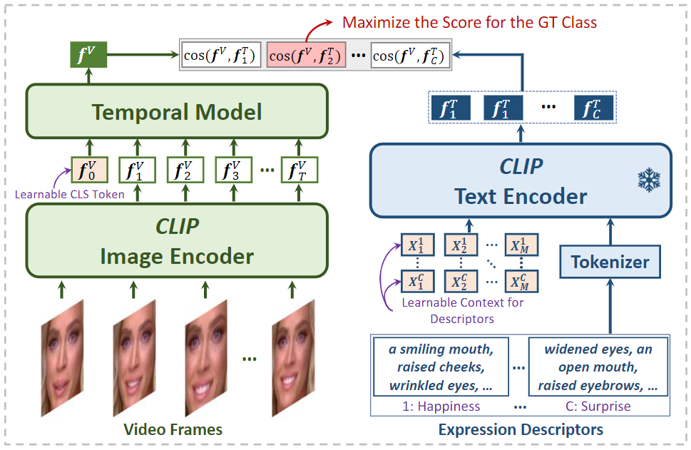

# DFER-CLIP

This is a PyTorch implementation of the paper:

*Zengqun Zhao, Ioannis Patras. "[Prompting Visual-Language Models for Dynamic Facial Expression Recognition]()", British Machine Vision Conference (BMVC), 2023.*

## Overview



## Requirement
The code is built with following libraries:
- pytorch
- scikit-learn
- einops
- matplotlib
- numpy
- math
- shutil
- tqdm

Extra setup is required for data preprocessing. Please refer to [preprocessing](./annotation/script.py).

## Training
We use the weight provided by OpenCLIP as the starting point for our training.

``` train_DFEW.sh ```, ``` train_FERV3k.sh ```, and ``` train_MAFW.sh ``` are for running on corresponding dataset. 

## Performance
Performance on DFEW, FERV39k, and MAFW benchmarks:


UAR: Unweighted Average Recall (the accuracy per class divided by the number of classes without considering the number of
instances per class); WAR: Weighted Average Recall (accuracy)

## Citation
If you find our work useful, please consider citing our paper:
```
@inproceedings{zhao2023dferclip,
  title={Prompting Visual-Language Models for Dynamic Facial Expression Recognition},
  author={Zhao, Zengqun and Patras, Ioannis},
  booktitle={British Machine Vision Conference (BMVC)},
  pages={1--14},
  year={2023}
}
```

## Acknowledgments
Our code is based on [CLIP](https://github.com/openai/CLIP) and [CoOp](https://github.com/KaiyangZhou/CoOp).
